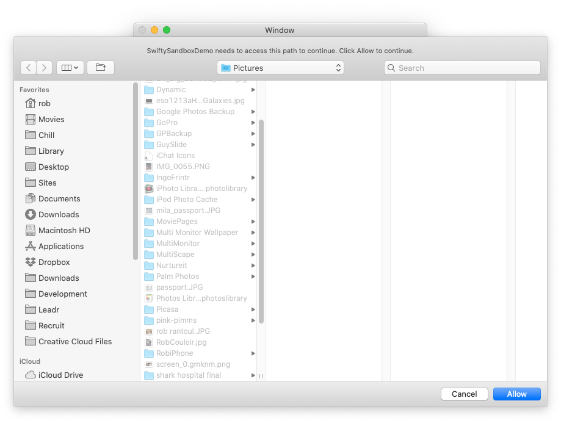

SwiftyAppSandboxFileAccess
====================

This is a swift version of the original [AppSandboxFileAccess](https://github.com/leighmcculloch/AppSandboxFileAccess) with a more swifty API and a couple of additional features.

Details
====================

A simple class that wraps up writing and accessing files outside a Mac apps App Sandbox files. The class will request permission from the user with a simple to understand dialog consistent with Apple's documentation and persist permissions across application runs using security bookmarks.

This is specifically useful for when you need to write files, or gain access to directories that are not already accessible to your application. For example if your application is introduced to file AwesomeRecipe.txt and wishes to generate AwesomeRecipe.txt.gz, this is not possible without gaining permission from the user. (Note: It is possible to write AwesomeRecipe.gz, you don't need this class to do that.)

When using this class, if the user needs to give permission to access the folder, the NSOpenPanel is used to request permission. Only the path or file requiring permission, or parent paths are selectable in the NSOpenPanel. The panel text, title and button are customisable.



How to Use
====================

### CocoaPods


```ruby
pod 'SwiftySandboxFileAccess'
```


In Xcode click on your project file, then the Capabilities tab. Turn on App Sandbox and change 'User Selected File' to 'Read/Write' or 'Read Only', whichever you need. In your project Xcode will have created a .entitlements file. Open this and you should see the below. If you plan on persisting permissions you'll need to add the third entitlement.


In your application, whenever you need to read or write a file, wrap the code accessing the file wrap like the following. The following example will get permission to access the parent directory of a file the application already knows about.

```
import SwiftySandboxFileAccess

class Manager {
    static let shared = Manager()
    
    /// Persist URL when a file is dropped on the dock (so permission is implicitly given)
    func persist(_ urls:[URL]){
        let access = AppSandboxFileAccess()
        for url in urls {
            _ = access.persistPermission(url:url)
            lastOpenedPath = url.path
        }
    }
    
    func clearStoredPermissions() {
        AppSandboxFileAccessPersist.deleteAllBookmarkData()
    }
    
    func pickFile(from window:NSWindow){
        let access = AppSandboxFileAccess()
        access.access(fileURL: urlToRequest,
                      fromWindow: window,
                      persistPermission: true) {
                        print("access the URL here")
        }
    }
    
    func pickFile() {
        let access = AppSandboxFileAccess()
        let success = access.access(fileURL: urlToRequest,
                                    askIfNecessary: true,
                                    persistPermission: true) {
                                        print("access the URL here")
        }
        print("success: \(success)")
    }
    
    func checkAccessToLastPath() {
        guard let lastOpenedPath = lastOpenedPath else {
            return
        }
        
        let access = AppSandboxFileAccess()
        let success = access.access(path: lastOpenedPath,
                                       askIfNecessary: false)
        
        print("access status : \(success)")
    }
    
	//see file in demo for utility details
}

```

Main Function Groups
====================

All functions have url or path variants. This shows only the url variants.

func persistPermission(url: URL) -> Data?

saves a permission which the app has recieved in some other way (dropped on dock, file open, etc)

func requestPermissions(forFileURL fileURL: URL, askIfNecessary:Bool = true ... ) -> Bool

Request permission to access a file. 

You can set askIfNecessary to false to check whether you have access without interrupting the user.


func requestPermissions(forFileURL fileURL: URL, fromWindow:NSWindow...

Request permission to access a file. If needed, the open panel will be presented as a sheet from the given window.

func access(fileURL: URL...

same as the requestPermission variants - but within the block, startAccessingSecurityScopedResource has already been called


License
====================

Copyright (c) 2013, Leigh McCulloch
and Rob Jonson
All rights reserved.

See included Licence file
